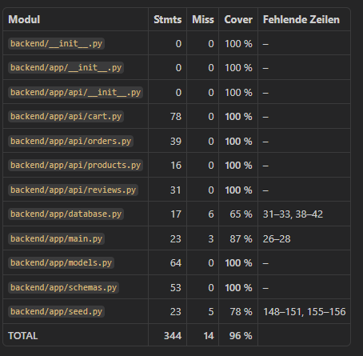

# Ergebnisse

## Multi-Agent System

### Codequalität
#### Backend:
- Der Code wurde sehr modular erstellt. Es wurde nach dem Prinzip "Separation of Concerns" gearbeitet.
- Funktionen wurden nicht zu voll gepackt. Es wurde keine "Spaghetti-Code" erstellt.
- Die Endpoints wurden in einen eigenen Ordner "/app/api" gegeben.
- Es sind Kommentare vorhanden aber nicht zu viele.
- Es wurde bei der Datenbank auf Constraints und nullable Attribute geachtet.
- In main.py wird von der IDE die Annotation @app.on_event als "deprecated" markiert. Es werden also Funktionalitäten herangezogen die bereits veraltet sind. Hier wäre Nachbesserungsbedarf.
- Es wurde auf Fehlerbehandlung geachtet (z.B. HttpException wird geworfen)
- Der Code scheint übersichtlich und wartbar zu sein.

#### Frontend
- Die IDE markiert einige Codestellen mit Warnings / Codesmells
- Das Frontend wurde in einige Components unterteilt was sehr gut ist
- Funktionen die Calls zum Backend machen wurden in ein eigenes File ausgelagert um sie in allen Components nutzen können

### Produktqualität
- Der Output hat auf Anhieb kompiliert
- Das Design der Applikation ist sehr modern und schlicht
- Die Applikation lässt fehlerfrei durchklicken
- Es gibt verzeinzelt Bugs z.B. beim Bestellabschluss wenn man als Postleitzahl einen String angibt - Inputvalidierung nicht vollständig
- Produktübersicht funktioniert
- Filter funktionieren
- Bestellabschluss funktioniert
- Bestelldetailseite funktioniert
- Warenkorb funktioniert
- Kontaktseite funktioniert
- Bewertung funktioniert

### Funktionale Korrektheit (bestehende Unit Tests)
- Alle 72 (von der KI generierten Unit-Tests) sind auf Anhieb durchgelaufen
- Es wurden Tests für die API, Warenkorbslogik, Datenbaankzugriff erstellt
- Für das Frontend wurden zwar Tests erstellt aber diese sond unnötig da sie hauptsächlich ob im File bestimmter Code vorhanden ist
- Für das Frontend wären echte e2e Tests erforderlich

### Testabdeckung

### Lesbarkeit und Wartbarkeit
#### Backend
- Aufgrund der oben genannten Punkte zur Codequalität wäre unseres Erachtens der Code lesbar und wartbar da sehr auf Kapselung geachtet wurde.
- Die Funktionen sind ordentlich benannt sodass man versteht was sie machen
- Da für die Endpunkte ein eigener API Ordner erstellt wurde findet man sich gut zurecht.
- Die Endpunkte sind thematisch gruppiert.

#### Frontend
- Das Frontend ist genauso gut lesbar wie das Backend. Es wurde sehr auf Kapselung geachtet
- Die Components und die verwendeten Funktionen wurden gut und verständlich benannt.
- Es ist leicht zu verstehen was was macht

### Effizienz
#### Verbrauch Token: 
- Input-Token: ca. 8,7 Millionen
- Output-Token: ca. 400.000
- Requests: ca. 300 Api-Requests
- Arbeitszeit: ca. 50 Minuten

### Kosten
- Gesamtkosten: 11.25 $

## Single-Agent System

### Codequalität

### Produktqualität

### Funktionale Korrektheit (bestehende Unit Tests)

### Testabdeckung

### Lesbarkeit und Wartbarkeit

### Effizienz (Anzahl Iterationen bis zur Lösung)

### Kosten